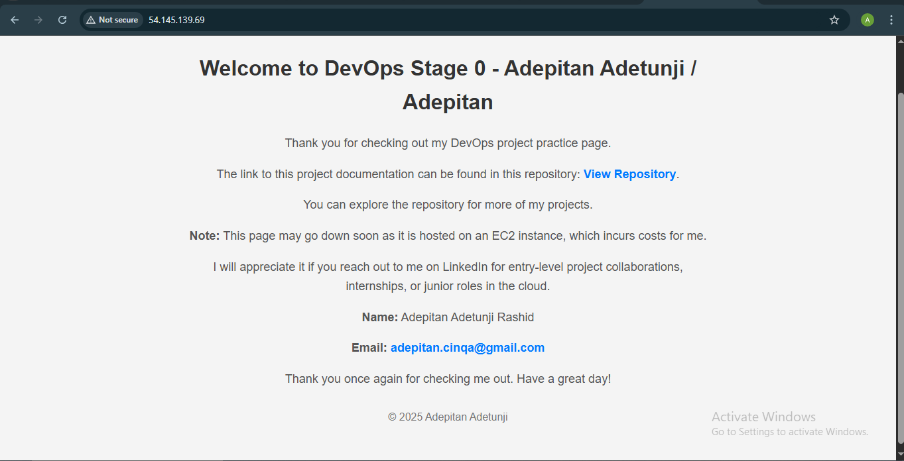

Configuring a Web Server Using Nginx

1.  This DevOps task challenges me to serve a webpage using NGINX and host this page on EC2 instance using AWS. I configured NGINX on Ubuntu, however, update and upgrade are required before proceeding to running NGINX, hencem I ran:

    sudo apt update

    sudo apt upgrade

2.  Afterwards, I also installed nginx and ran it.

3.  The next step involved using an editor (vim) to write my html code in the var/html folder. My html code was named “index.html”. I consulted YouTube for the tutorials on how to write basic html code.

4.  The next step now involved restarting my nginx and testing the code with the address http//:localhost which loaded the page with my html code.

5.  After my NGINX was configured and running successfully, it was time to host it on AWS Cloud. Thus, I navigated to my AWS management console, created an ec-2 instance using the t2.micro instance size in order to save costs,. Ubuntu was selected as the OS type while I created a key pair so I could connect using ssh. I also configured the security group to take ssh connection on ssh port 22 from my computer and also http port 80 from anywhere IPV4. This enables only me to remotely log into my ec2 instance using the ssh key.

6.  I then navigated back to my Ubuntu terminal, because I was using it from the WSL, I could not access my files directly, so I had to input the code below:

    cd /mnt/c/Users/Your-Windows-Username/

7.  After accessing the files, I had to change the mode in order to restrict access to the key pair. I also  used the name of the key-pair downloaded and the instance public IP copied to connect using the codes below:

    chmod 400 ~/your-key.pem

    ssh -i ~/your-key.pem ubuntu@your-public-ip

The website page was ready and loading. A picture of the webpage is provided below, the address is also attached and can be viewed until when the ec2 instance is terminated.

If the website is not accessible, it means the ec2 instance has been terminated for cost purposes.

    http://54.145.139.69

The website was open and functional.
