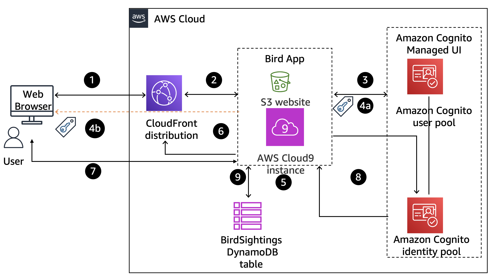

This lab documents my project on configuring Amazon Cognito for a brid web application access, including students and administrator access
###
A zip folder was already provided containing the web application codes and configurations, so I simply installed it first using the "wget" command plus the zip file link. Thereafter, I unzipped them into the folder

After installation, I navigated to the resources folder using the "cd" function:

    cd resources

Thereafter, I set the environment up and installed the configured files using the script:

    . ./setup.sh

###
CASE SCENARIO

You have the Birds web application, which was built by using a NodeJs server running on an AWS Cloud9 instance and an Amazon Simple Storage Service (Amazon S3) bucket with static website hosting capability. The Birds application tracks students' bird sightings by using the following components:

1. A home page

2. An educational page that teaches students about birds

3. The following three protected pages, which students can access only if they have been authenticated:

4. A sightings page where students can view past bird sightings

5. A reporting page where students report new bird sightings

6. An administrator page where site administrators can perform additional operations

7. You need to add authentication and authorization to the application for the protected pages.

Step	Explanation
1	The user requests access to the administrator page from the browser.
2	The request is routed to the NodeJs application server that is hosting the Birds application.
3	The application redirects the request to the Amazon Cognito managed UI.
4a	The user is authenticated by the Amazon Cognito user pool, and the access token is returned to the application.
4b	The Amazon Cognito SDK also stores the access token in browser's local storage for subsequent use, with the default expiration of 3,600 seconds.
5	The application validates the token and returns the administrator page as requested.
6	The page is returned to the user's browser through the Cloudfront distribution.
7	The user initiates a query to a DynamoDb table.
8	The application sends the token to the Amazon Cognito identity pool and receives temporary AWS credentials upon validation.
9	The application uses the received credentials to query the DynamoDB table and return data to the protected page. The page is returned to the user's browser through the Cloudfront distribution.

The diagram illustration of the task is presented below:

After my files have been installed, I updated the unzipped codes to point my web application code to the node server's API endpoint. This was done by replacing a placeholder with the cloudfront domain.

I also copied the static web contents to my s3 folder since s3 bucket is used to host the static web contents. The code that helped:

aws s3 cp website s3://<s3-bucket>/ --recursive --cache-control "max- age=0"

The web application uses a nodejs server, so I had to navigate to the node server directory and start the node server using:
npm start

Here, the sightings, reports, siteadmin pages are not accessible because the Cognito access has not been configured. The next steps provide details on the process of configuring them

NEW Task: Configuring Amazon Cognito User Pool

For this task, I started by setting up a cognito application, I first created a user pool using the AWS Management console, I used email as the required attribute and added the cloudfront domain as a return url + "callback.html" for signup. I named my app "bird_app_client"

Still configuring my cognito app, I configured my user pool by using the "Authorization code grant" feature for the OAuth 2.0 grant types. the implicit grant is selected.

For OpenID COnnect Scopes, I selected Email and OpenID. I saved the Client ID to my editor for further references

For Autehntication flows, I selected "ALLOW_USER_PASSWORD_AUTH"

I also saved my Amazon Cognito domain prefix by copying some parts after the url. My user_pool was successfully created and named bird_app

After I have configured my user_pool, the next task is to add users to this pool. Still in the management console and in my bird_app_client cognito appliocation, I created users with details that required user name and password. I created one user_name for test users and another user for admin users (admin users has administrative permissions)

For the admin user created, because it has administrator access, I created a group named "Administrators" and added the admin user to that group

### NEW TASK (updating the bird application to use the user pool for authentication)

Now, having set up users and groups for the application, it's now time to configure the web application to use the cognito configured in our cognito application. to do this:
1. The application file was updated to include the cognito details allowing for interaction
2. I went back to my CloudIDE
3. I terminated the nodejs running using "Ctrl + c"
4. I updated the website/scripts folder (config.js file) with the following placeholders
    - Cognito Domain
    - User-pool ID
    - Client ID
    - Cloudfront distribution
