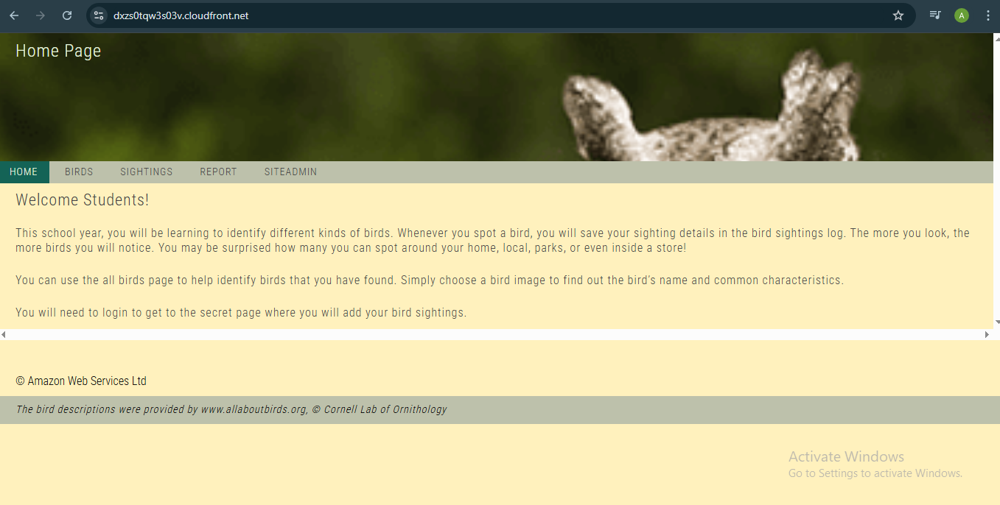
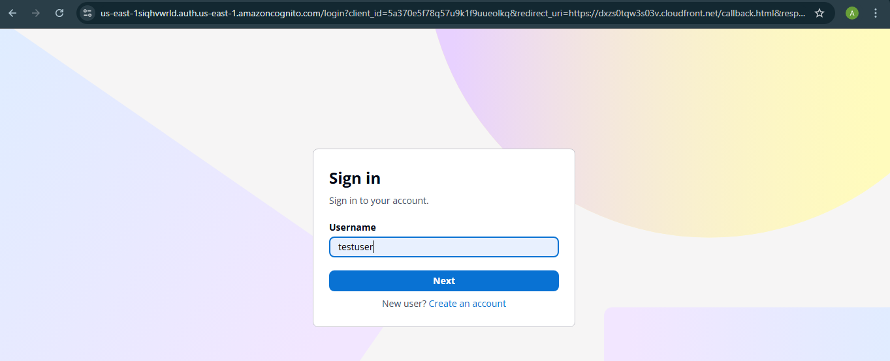
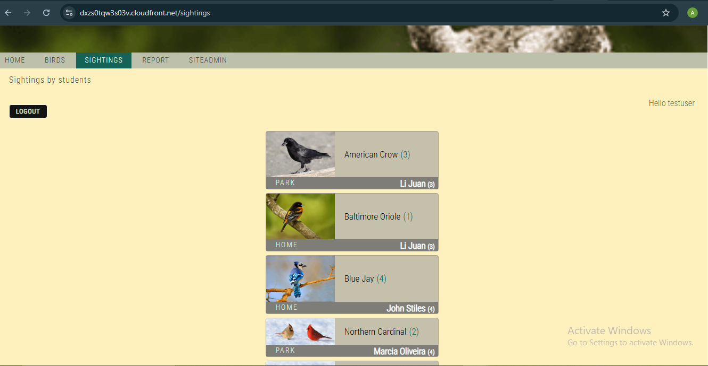
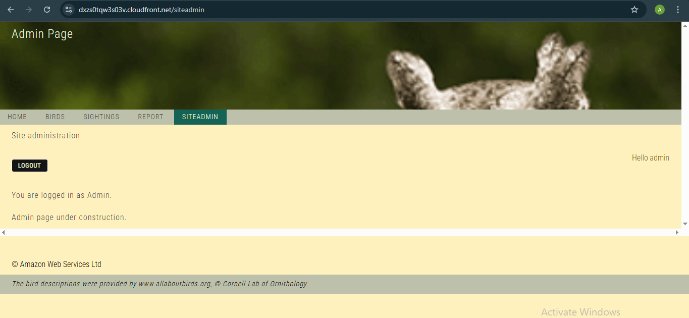
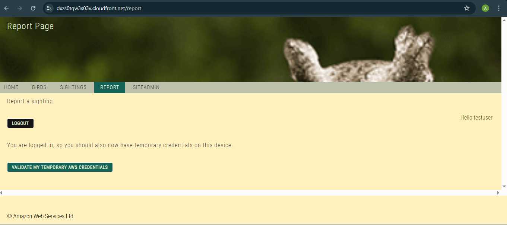
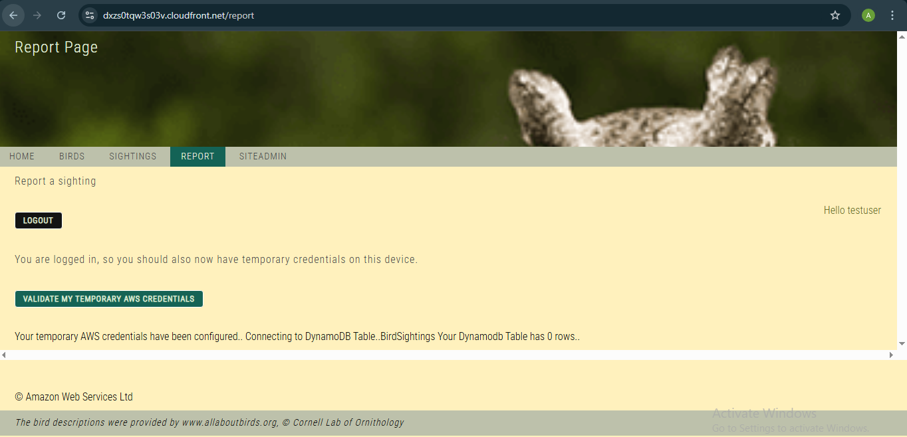

This lab documents my project on configuring Amazon Cognito for a brid web application access, including students and administrator access
###
A zip folder was already provided containing the web application codes and configurations, so I simply installed it first using the "wget" command plus the zip file link. Thereafter, I unzipped them into the folder

After installation, I navigated to the resources folder using the "cd" function:

    cd resources

Thereafter, I set the environment up and installed the configured files using the script:

    . ./setup.sh

###
CASE SCENARIO

You have the Birds web application, which was built by using a NodeJs server running on an AWS Cloud9 instance and an Amazon Simple Storage Service (Amazon S3) bucket with static website hosting capability. The Birds application tracks students' bird sightings by using the following components:

1. A home page

2. An educational page that teaches students about birds

3. The following three protected pages, which students can access only if they have been authenticated:

4. A sightings page where students can view past bird sightings

5. A reporting page where students report new bird sightings

6. An administrator page where site administrators can perform additional operations

7. You need to add authentication and authorization to the application for the protected pages.

Steps and Explanation
1. The user requests access to the administrator page from the browser.
2. The request is routed to the NodeJs application server that is hosting the Birds application.
3. The application redirects the request to the Amazon Cognito managed UI.
4. a. The user is authenticated by the Amazon Cognito user pool, and the access token is returned to the application.
4. b. The Amazon Cognito SDK also stores the access token in browser's local storage for subsequent use, with the default expiration of 3,600 seconds.
5. The application validates the token and returns the administrator page as requested.
6. The page is returned to the user's browser through the Cloudfront distribution.
7. The user initiates a query to a DynamoDb table.
8. The application sends the token to the Amazon Cognito identity pool and receives temporary AWS credentials upon validation.
9. The application uses the received credentials to query the DynamoDB table and return data to the protected page. The page is returned to the user's browser through the Cloudfront distribution.

The diagram illustration of the task is presented below:

After my files have been installed, I updated the unzipped codes to point my web application code to the node server's API endpoint. This was done by replacing a placeholder with the cloudfront domain.

I also copied the static web contents to my s3 folder since s3 bucket is used to host the static web contents. The code that helped:

    aws s3 cp website s3://<s3-bucket>/ --recursive --cache-control "max- age=0"

The web application uses a nodejs server, so I had to navigate to the node server directory and start the node server using:
npm start

The website was accessed using the CloudFront domain copied and setup earlier. The image of the website is shown below:

Here, the sightings, reports, siteadmin pages are not accessible because the Cognito access has not been configured. The next steps provide details on the process of configuring them

NEW Task: Configuring Amazon Cognito User Pool

For this task, I started by setting up a cognito application, I first created a user pool using the AWS Management console, I used email as the required attribute and added the cloudfront domain as a return url + "callback.html" for signup. I named my app "bird_app_client"

Still configuring my cognito app, I configured my user pool by using the "Authorization code grant" feature for the OAuth 2.0 grant types. the implicit grant is selected.

For OpenID COnnect Scopes, I selected Email and OpenID. I saved the Client ID to my editor for further references

For Autehntication flows, I selected "ALLOW_USER_PASSWORD_AUTH"

I also saved my Amazon Cognito domain prefix by copying some parts after the url. My user_pool was successfully created and named bird_app

After I have configured my user_pool, the next task is to add users to this pool. Still in the management console and in my bird_app_client cognito appliocation, I created users with details that required user name and password. I created one user_name for test users and another user for admin users (admin users has administrative permissions)

For the admin user created, because it has administrator access, I created a group named "Administrators" and added the admin user to that group

### NEW TASK (updating the bird application to use the user pool for authentication)

Now, having set up users and groups for the application, it's now time to configure the web application to use the cognito configured in our cognito application. to do this:
1. The application file was updated to include the cognito details allowing for interaction
2. I went back to my CloudIDE
3. I terminated the nodejs running using "Ctrl + c"
4. I updated the website/scripts folder (config.js file) with the following placeholders
    - Cognito Domain
    - User-pool ID
    - Client ID
    - Cloudfront distribution
I then saved the file to update the changes

The updated website was also pushed to the s3 bucket to reflect the new changes in the website. To do that, I repeated the code:

    aws s3 cp website s3://<s3-bucket>/ --recursive --cache-control "max-age=0"

The node server files need to be updated as well with the new configuration. Hence, I updated the files: package.json and mw.json to include the new configuration.

This allows the website to use the new Cognito setup. The code simply involve copying the files to duplicates which the website will use. Hence, I ran:

    cd /home/ec2-user/environment/node_server
    cp package2.json package.json
    cp libs/mw2.js libs/mw.js

The package.json code was also updated. I replaced the use-pool placeholder with the correct user-pool details generated while setting up Cognito user-pool. The code which I replaced is:

    "start": "REGION_STR=us-east-1 USER_POOL_ID_STR=us-east-1_AAAA1111 node index.js"

I tested the code configuration and the cognito setup. I navigated to the "sightings" page and it requested access before I could log in as shown below:

After I used the login credentials configured earlier, the sightings page now becomes accessible as show below:

The same process was done to the admin page, login was requested and after inputing the login credentials, the page was accessed as shown below:

### NEW TASK: CONFIGURING THE IDENTITY POOL

The purpose of configuring the identitiy pool is to verify users' login credentials before allowing access to the bird sightings and admin page. Thus, if their identity is not verified, they will not be allowed to access the pages. If verified, they will be allowed page access. The steps are provided below:

1. An identity pool was already created upon launching the environment

2. The pool ID link was copied, to be used later.

3. An identity provider was setup, I selected Cognito user pool as sign in feature and used the bird application and bird_app_client

4. A default authenticated role was selected to use alongside the Identity provider

### New Task: Updating the application to use the identity pool for authorization

After configuring an identity pool with Cognito user pool, it is necessary to update the application to use our new feature of identity pool. The steps are explained below:

1. If node server is running, we terminate node server using "CTRL + c"

2. We update the file /website/scripts/config.js by uncommenting the identity_pool placeholder and inputing the identity pool link saved earlier. The file is then saved

3. We also update the /website/scripts/auth.js file by replacing the placeholder in the config section with cognito user pool ID

This section of code uses the COGNITO_IDENTITY_POOL_ID_STR variable, which WAS set in the config.js file. The code uses this identifier to request credentials from the identity pool. The code block also passes the user pool ID and token_str_or_null, which holds the authentication token. The identity pool uses this information to verify the user in the user pool. If the user and token pass the validation, the identity pool sends AWS credentials back to the application.

4. The update and changes are pushed again to s3 using the code:

    aws s3 cp website s3://c107432a2525761l9267913t1w702788327583-s3bucket-lw3i1fenlkky/ --recursive --cache-control "max-age=0"

5. After copying to the s3 bucket, we navigate back to the node_server environment and start the node_server using:

    npm start

6. We now test the new feature by accessing the report page in the bird web application by using the admin credentials. The feature works when it asks if to verify AWS credentials as shown in the image below:

After validation, we get the following on the site page:

The application now uses the identity pool to generate temporary credentials and uses the same credentials to access the BirdSightings DynamoDB table. After successfully connecting to the database table, the application attempts to count the number of rows (0) and returns the following message: Your temporary AWS credentials have been configured.. Connecting to DynamoDB Table..BirdSightings Your Dynamodb Table has 0 rows..

This test verifies that you have correctly configured the Amazon Cognito identity pool and the application. Users who are logged in are able to access temporary credentials to communicate with the DynamoDB database.

# END OF LAB

The next lab (lab-02) explains how the dynamodb table was now configured
