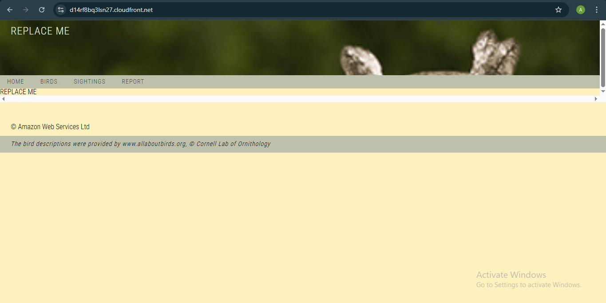
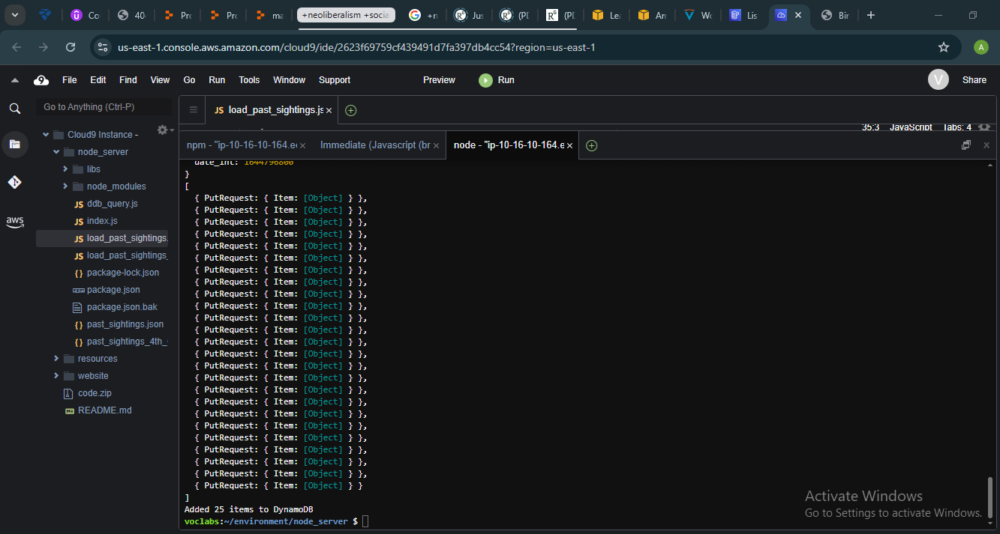
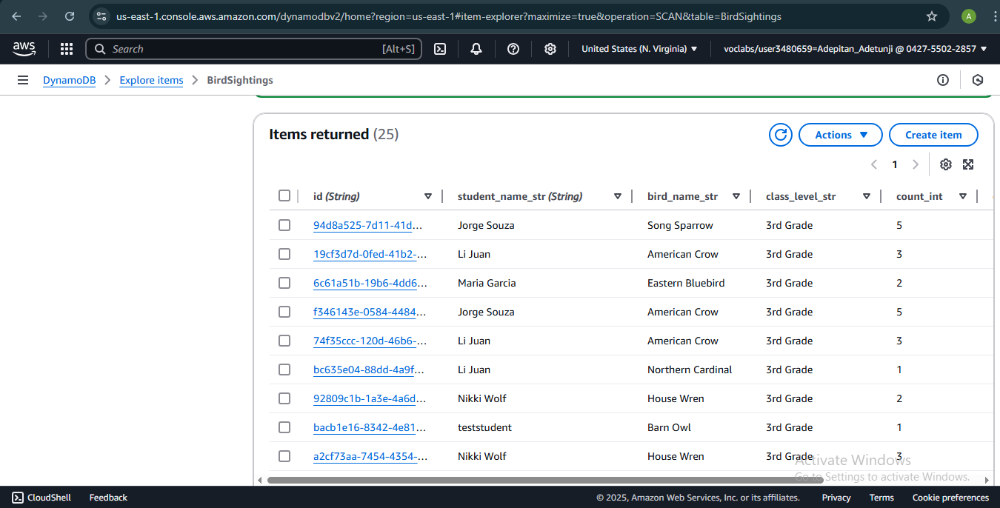

This lab involve task that deal with creating an Amazon DynamoDB table and using it to support a web application (the bird web application). The task objectives include the following:

    - Use the AWS Management Console to create a DynamoDB table.
    - Use a batch script to insert multiple records into a DynamoDB table.
    - Update the website to read items from the DynamoDB table.
    - Update the website to add items to the DynamoDB table.
    - Use the console to create a global secondary index (GSI) for a DynamoDB table.
    - Query table data by using a GSI.
### SCENARIO

In the first lab involving Cognito setup and configuration, security has been configured for the application using Amazon Cognito.

By using an Amazon Cognito user pool, we have required users to log in to reach both the Sightings page and the Report page on the website. We also verified that the Amazon Cognito identity pool provides the logged in user with credentials that the application can use to interact with AWS services such as DynamoDB.

So far, the application has been using a JSON formatted text file to provide static bird sighting data to the website's Sightings page. Now that we have taken care of security, we will update the application to provide live data to the application.

First, we will create a DynamoDB table to store bird sighting records. Then, we will load historical data into the table. We will update the website code to retrieve items and add new items to the table. Finally, we will update a script to provide a weekly report for Ms. García.

### TASK ONE: CONNECTING TO CLOUD9
A cloud9url was already setup, in the AWS Console, we access the Cloud9 and click on the url which opens an IDE for us to use throughout the task.

We pass in a "wget" command and a url to install the web application codes for use. the code pattern is:

    wget <zip folder link>

Afterwards, we unzip using:

    unzip code.zip

then, we set up using:

    . ./setup.sh

The codes above set our web application code up which we will use throughout the tasks.

A cloudfront domain is provided and an s3 bucket which will be needed for further use. Therefore, they are saved into a text document outside the IDE alognside other texts which are needed later in the tasks. They include:

    - CloudFront distribution domain
    - S3 Bucket
    - Table name:
    - Table partition key:
    - Table sort key:
    - Password:
    - Index name:
    - Index partition key:
    - Index sort key:
After inputing the available values, we navigate back to the node_server folder to start and use the application.

    cd ..
    cd /node_server/
    npm start

This deploys our cloudfront distribution using the cloudfront domain derived earlier, we check the availability status and once it's in an "enabled" stage, we can use the domain to access the bird web application. The page image without dynamoDB set up is shown below:

### TASK TWO: Creating a DynamoDB table

To store and dynamically manage student bird sighting data, we create a new DynamoDB table.

Initially, we will create this table with only two attributes. Every DynamoDB table requires a primary key. For this table, we will configure a composite primary key, which means it will have a partition key and a sort key.

The first attribute that we will define in the table is id, which will be the table's partition key. The second attribute will be student_name_str, which will be the sort key.

We navigate to DynamoDB through the AWS Console

We click on "create table", table name is "BirdSightings"; partition key is "id" with string format selected
sort key is "student_name_str" with string format also selected. These values are kept in the notepad variables stored earlier.

### Task 3: Adding multiple records to the table by using a batch script

In this task, we use a batch script to load multiple data into the table. we use a batch script because its efficient and faster than using manual entry which can also generate errors. Hnece, we write a script that reads through multiple entries and loads them into the table while also formatting them

We edit the javascript file that contains the script by replacing the dynamodb placeholder with the dynamoDB table name "BirdSightings". The name of the file is "load_past_sightings.js"

After saving the file, we open another terminal while the first terminal is still running, we then run the loas_past_sightins.js by running:

    node load_past_sightings.js

It loads the sightings and displays an image just like it's shown below:

Upon loading the records of the past sightings, we navigate back to our AWS Console and click on the table created. We click on "explore table items" and select the "scan" feature. It displays our recently loaded items which we did from the IDE, a picture of it is shown below:

However, when we created our table using the console, we setup only two attributes, our records loaded into the table from the IDE returned seven attributes. This is possible because DynamoDB is expandable and can include more attributes unlike the SQL which must tally with the schema set. DynamoDB is NoSQL, hence, the difference in attribute cannot fail its loadings.

### Task 4: Retrieving data programmatically by using the scan method

In the Amazon Cognito lab, the Birds website returned a list of past bird sightings by reading them from a static file. In this task, you will update the website code to show dynamic data from your BirdSightings table. This way, when students add more records in the future, the new records will automatically display on the Sightings page in the application.

The AWS SDK offers multiple methods to retrieve data from a DynamoDB table. One method is the scan operation. A scan operation reads every record in a table or a secondary index. If you want to retrieve every record, this is the best method to use.

In this task, you will update the website code to scan records from your DynamoDB table.
