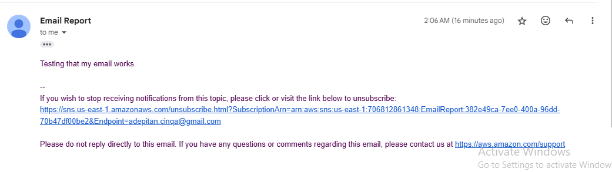

This is the lab documentation on AWS Step Functions

In this lab, we will use AWS Step Functions to coordinate the actions necessary to generate and deliver a report upon request. The report will contain data from a database.

### Lab Objectives
    - Create an Express asynchronous state machine by using Step Functions.

    - Configure a Step Functions state machine to call Amazon Simple Notification Service (Amazon SNS).

    - Configure AWS Lambda functions to be invoked from a Step Functions state machine.

    - Use a Parallel state flow object in the design of a Step Functions state machine.

    - Invoke a state machine to start using the AWS SDK for JavaScript.

### Case Scenario

So far, in lab_01 and 02, we have created a web application that is secured with Amazon Cognito and is integrated with Amazon DynamoDB. The application allows logged in users to view existing items in a table and add new items to it.

There is now a new task. Currently, the application only displays the records for the logged in student. It is requested that there should be a way to run a report that will show the teacher all of her student's bird sightings. She likes the formatting of the sightings for the web page. However, she would like a more printer friendly format for this report that does not include the images. Most importantly, this report must be secured so that only the teacher that requested the report can access it.

In this lab, we will configure a Step Functions state machine to retrieve database items, format them into an HTML report, generate a secure link to access the report, and finally to send the report link to the teacher using SNS. You will then update the Bird Sightings web application to call the state machine.

### Task 1: Preparing the lab

We log into the AWS console and navigate to the Cloud9 services. An IDE is already confugred, we click on the link and it takes us to the IDE where we upload our website codes and work with it throughout the lab.

We upload the web code using the "wget" command and installing the codes using the link provided

We unzip the code and install the dependencies using:

    . ./setup.sh

### Task 2: Subscribing to the SNS topic

In this task you will subscribe to an SNS topic that notifies application users when a requested report is available.
To do so, we navigate back to the console, select SNS and click on al already available SNS topic named "EmailReport"

We create a subscription by clicking on "create subscription"
The topic arn is selected and "email" option is selected.

W add an email as the "endpoint" and click on "create subscription" We also confirm the subscription through the email sent after creating subscription.

Now, we test the subscription created. We click on "publish message", we type "test" as the message head and "Hello, this is a test" as the main message, then click on publish. The email received is shown below:

### Task 3: Creating a StateMachine to send email
Here, we create a state machine to create a workflow.
We start by creating only one workflow to test it

To create a state machine, an IAM Role is needed, one has already been created which we attached several Lambda functions to allow the workflow run

We now create a state machine, navigate to the console, use the search icon and type "step functions"

We click on "create state machine", it opens a page for us after we select blank page. we also name it our desired name.

On the blank page is a platform where we can drag features to perform the workflow function

We click on the search icon by the left pane to search on "sns" then drag it to the blank page. Now we configure it by selecting "json path" as the format type.

We select our E-mail report ARN as API Parameter type

Message is set to Use state input as message

We also configure the code for the state machine. The image of the code is provided below while the txt file is in this folder as well:

The workflow is then tested, we do this by clicking on "start execution". On the next page, we input this into the json placeholder to test the function:
"presigned_url_str": "Testing that my email message works"

We get an email that includes the message "testing that my email message works". The email is attached below:

### Task 4: Adding the GeneratePresignedURL Lambda function to the state machine
In this task, we create a report.html page with a test message and upload the file to Amazon S3. We then use the AWS Command Line Interface (AWS CLI) to create and test a presigned URL to access the page. Finally, we add a Lambda function to the state machine that we created earlier.

We first test by uploading a sample html page to s3 and running a step flow to generate the HTML url.

1. We create a new HTML file and input the sample code:

    <output>Hello! This is some sample HTML.</output>

2. We navigate back to the environment folder and upload the sample report to s3 using the commands below:

    cd /home/ec2-user/environment
    bucket=`aws s3api list-buckets --query "Buckets[].Name" | grep s3bucket | tr -d ',' | sed -e 's/"//g' | xargs`
    aws s3 cp report.html s3://$bucket/ --cache-control "max-age=0"

3. Upon successful upload and confirmation of existence in the s3 management console, we generate a presigned url to access the web page and test it. the code to generate the url is:

    aws s3 presign s3://$bucket/report.html --expires-in 30

### Note: The url is set to expire in 30 seconds, so it won't be accessible after 30 seconds

4. We click on the url it generates and the page loads without errors within 30 seconds, the page is shown below:

After 30 seconds, access to the page is revoked

### Testing the GeneratePresignedURL Lambda function
A Lambda function that generates a presigned URL for the report.html Amazon S3 object was already created. Now, we test the function to ensure it is working corectly before integrating it into the work flow.
1. We navigate to the Lambda console and click on the GeneratePresignedURL Function
2. Choose Test, and for Event name, enter test1
3. Choose Create, and then choose Test again.

The response includes a presigned URL which also takes us to the HTML page.

Now that we have tested and confirmed the function is working properly, we infuse it into the workflow as well. However, we only do it to test the html report here. The process is repeated to test on original html report rather than the sample report. Hnce, the workflow integration is detailed in the next section.

### Task 5: Adding the generateHTML Lambda function to the state machine
This is where we add the proper generatedHTML lambda function to the state machine. After testing it through the Lambda console, we integrate it into our workflow.

We will add an additional state to the state machine to invoke the generateHTML Lambda function. Because the presigning doesn't depend on the HTML generation step, these steps can run in parallel.

By running the generateHTML and GeneratePresignedURL steps at the same time, the state machine will run more quickly. In Step Functions, the workflow advances to the next task only after the slowest of the parallel states completes.

1. In our statemachine (AdepitanStateMachine), we click on flow tab

2. We drag the Parallel object onto the canvas just above the Lambda: Invoke GeneratePresignedURL object.

3. We drag the Lambda: Invoke GeneratePresignedURL object to the box labeled Drop state here on the right under the Parallel state object

4. We add the generateHTML function to the state machine, and configure it.

    - In the left pane, we choose the Actions tab.

    - Search for Lambda

    - We drag the AWS Lambda Invoke object onto the canvas to the box labeled Drop state here on the left, under the Parallel state object.

    - We choose the new Lambda Invoke object and configure the following function details in the Lambda Invoke pane.

        - State name: generateHTML

        - Function name: generateHTML:$LATEST.

        - Payload: Use state input as payload.

        - Next state: Go to end.

The image representation of the workflow is presented below:

5. We configure the Parallel state card details, and then save the changes.

    - On the canvas, we choose the Parallel state object.

    - For State name, we enter Process Report

 6. In the state machine ASL code, we update the SNS Publish object details to format the message text.

     - In an earlier step, we added .presigned_url_str to the line that now reads "Message.$": "$.presigned_url_str" .
Since we are now generating a link now, we update that line of code to:

    "Message.$": "$",

We save the changes and we test our workflow.

7. We click on "start execution and in our json placeholder, we input the following:

    {
  "bird_obj_arr": [
    {
      "class_level_str": "3rd Grade",
      "location_str": "Home",
      "bird_name_str": "Northern Cardinal",
      "student_name_str": "Maria Garcia",
      "date_str": "2-21-2022",
      "id_str": "373453bd-722d-454f-8b4b-1ec53e2df9b0",
      "count_int": 2
    },
    {
      "class_level_str": "3rd Grade",
      "location_str": "Home",
      "bird_name_str": "Baltimore Oriole",
      "student_name_str": "Li Juan",
      "date_str": "12-20-2021",
      "id_str": "bd6560ac-ee19-4ef4-ac73-8deb61520601",
      "count_int": 1
    },
    {
      "class_level_str": "3rd Grade",
      "location_str": "Lake",
      "bird_name_str": "American Kestrel",
      "student_name_str": "Jorge Souza",
      "date_str": "01-30-2022",
      "id_str": "591d0b66-87ba-4e15-aadf-b0db6e63f089",
      "count_int": 5
    }
  ]
}

We click on "execute" and check our email for a new url link received. When we open the url, the image below is what we get:

### Task 6: Adding the getRealData Lambda function to the State Machine
